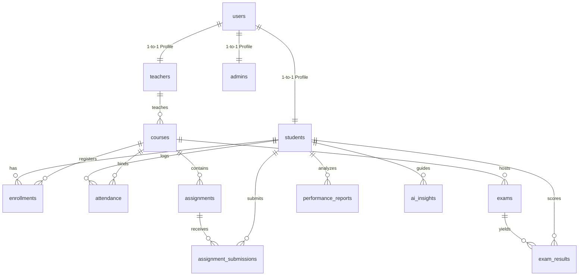

# 🎓 EduPulse AI — Next-Gen Academic Remediation & AI Co-Pilot Platform

> **A real-time, AI-powered academic analytics dashboard and risk remediation system designed to improve attendance rates, predict exam performance, eliminate subject credit backlogs, and provide students with tailored AI study guidance.**

---

## 💡 The Problem & The Solution

### ⚠️ The Problem
In modern higher education:
1. **Attendance Slippage:** Students often fail to maintain the mandatory attendance requirement (typically 85%) due to lack of visibility, leading to eligibility issues.
2. **Untracked Risk & Backlogs:** Subject backlogs are only detected after final semesters, when it's too late for remedial actions.
3. **Overloaded Faculty:** Professors waste valuable time on administrative reporting, spreadsheet analysis, and generic student mentoring rather than personalized support.

### 🌟 The Solution
**EduPulse AI** bridges the gap with:
- **A Dynamic Risk Analyzer:** Automatically computes academic risk scores using deterministic rules (combining live attendance, practical labs, and exam scores).
- **An AI Study Co-Pilot:** Leverages the **Groq LLM Cloud API (Llama 3.3)** to analyze students' performance metrics and generate customized daily study schedules and attendance recovery goals.
- **Role-Based Portals:** Dedicated, premium interfaces for **Students**, **Faculty/Teachers**, and **Admins** built with React, Tailwind CSS, and Recharts.

---

## 🔥 Key Features Highlight

### 👤 1. Student Portal & Study Hub
* **Real-Time GPA & Rank Tracking:** Instant view of academic GPA (10-point scale) and class rank.
* **Attendance Watchdog:** Monitors mandatory attendance clearance. Gives actionable alerts showing exactly how many consecutive classes to attend to cross the 85% safety threshold.
* **Target GPA Simulator:** An interactive tool allowing students to drag sliders or input custom marks to simulate how upcoming test marks will impact their overall GPA.
* **AI Academic Recommendations:** Interactive study plans generated for weak subjects (<60% score).
* **Interactive AI Chat Advisor:** Connects to the Groq LLM API to answer student queries about topics they find difficult (with smart offline fallbacks).
* **Built-in Pomodoro Timer:** A 45-minute focus timer on the recommendations page to encourage scheduled learning blocks.
* **Practice Hub with Solution Reveals:** Curated practice problems for weak areas, letting students toggle solution code/explanations.
* **Transcript & Diagnostic Downloader:** One-click download of the complete academic performance report as a local `.txt` file.

### 👩‍🏫 2. Faculty / Teacher Portal
* **Class Health Dashboard:** Visual representation of pass percentages, average attendance, and average class grades using dynamic charts.
* **Student Risk Monitor:** Flags students as **High**, **Medium**, or **Low** risk based on real-time attendance and academic performance.
* **Editable Student Record Modal:** HOD/advisor can update student internal marks, lab records, assignment grades, and class attendance in real-time.
* **CSV Roster Export:** Instant CSV download containing student directory, grades, attendance, risk scores, and primary factors.

### 👑 3. System Admin Portal
* **System Metrics Overviews:** Summary cards showing total students, teachers, and active courses.
* **User & Course Administration:** Manage/edit students, teachers, and courses.
* **Academic Reports Generation:** Centralized reports showing cross-department performance statistics.

---

## 🛠️ The Tech Stack

| Layer | Technology | Key Purpose |
| :--- | :--- | :--- |
| **Frontend** | React (Vite), Tailwind CSS | Fast rendering, glassmorphic dark-theme UI |
| **Visualization** | Recharts, Lucide Icons | Analytics graphs, charts, and modern micro-interactions |
| **Backend** | Node.js, Express.js | Core API gateway & business routing |
| **AI Integration** | Groq API (Llama 3.3 70B), Custom Risk Engine | Hyper-personalized advice generation & backlog prediction |
| **Database** | Supabase (PostgreSQL) | Secure relational schema, RLS policies, live data syncing |

---

## 📊 Database Schema

The PostgreSQL schema is structured to run efficiently on **Supabase** with indexing for quick response times.



### Relational Tables
1. **`users`**: Central profiles (contains passwords, emails, roles).
2. **`students`**: Stores attendance metrics, GPA, roll number, advisor, and risk JSON models.
3. **`teachers`**: Department information, HOD assignment, class, and active pupil metrics.
4. **`courses`**: Details course codes, credits, and links to teachers.
5. **`enrollments`**: Relational junction connecting students to their active courses.
6. **`attendance`**: Daily session log (Present, Absent, Late).
7. **`assignments` & `assignment_submissions`**: Tracks internal lab/practical files, marks, status (graded/late), and teacher feedback.
8. **`exams` & `exam_results`**: Mid-sem and End-sem exam statistics.
9. **`performance_reports` & `ai_insights`**: Populated by the backend AI analysis engine.

---

## 🔑 Demo Access Credentials

The platform features a **robust database fallback system**. If Supabase is not connected, the server automatically boots into **Mock Fallback Data Mode** allowing the app to run fully offline. Use these credentials to demo:

| Portal | Username / ID | Password | Key Persona Highlighted |
| :--- | :--- | :--- | :--- |
| **Student** | `23CSE001` | `student@123` | **Keerthivasan** — Moderate Risk (Attendance: 82%, Math: 58%) |
| **Student** | `23CSE002` | `student@123` | **Ananya Sharma** — Top Ranker (Attendance: 94%, GPA: 9.2) |
| **Faculty / Staff** | `STF001` | `staff@123` | **Dr. A. Ramanathan** — Professor & CSE HOD |
| **System Admin** | `ADM001` | `admin@123` | **System Administrator** — Database & User controllers |

---

## 🚀 Setup & Installation (With Running Comments)

Follow these steps and code comments to get the entire multi-portal system running locally:

### 1️⃣ Clone & Repository Setup
First, enter your terminal and make sure you are in the root of the project directory:
```bash
# Navigate to the workspace root directory containing client and backend folders
cd Buildathon-Repo
```

---

### 2️⃣ Backend Configuration & Startup
Next, set up the Express.js server:
```bash
# 1. Step into the backend folder where the API code lives
cd backend

# 2. Clean install all server packages (Express, Supabase-js, dotenv, nodemon)
npm install

# 3. Create the local environmental configuration from the example file
# For Windows command prompt/PowerShell:
copy .env.example .env
# For macOS/Linux terminals, use: cp .env.example .env
```

Now, open the newly created `.env` file in your editor and input your API keys.
If you leave them as default, the backend will auto-detect and run in **Fallback Mock Mode** (which is perfect for offline Hackathon demos):
```env
PORT=5000
SUPABASE_URL=your-supabase-url
SUPABASE_ANON_KEY=your-supabase-anon-key
GROQ_API_KEY=your-groq-api-key
```

To run the backend database locally or setup the cloud database, run the SQL script in your Supabase SQL editor:
* [`backend/schema.sql`](file:///c:/Users/Asus/OneDrive/Desktop/college/buildthon/Buildathon-Repo/backend/schema.sql)

Finally, start the backend node server:
```bash
# Starts the server in development mode with nodemon (auto-reloads on file changes)
npm run dev

# Alternative: Starts the server in production mode
npm start
```
*Once started, you will see output confirming:*
`🚀 Backend Server running at http://localhost:5000`

---

### 3️⃣ Frontend Client Startup
Open a separate terminal window or tab, and return to the root folder:
```bash
# 1. Ensure you are in the root directory (parent of backend/ and src/)
cd Buildathon-Repo

# 2. Install all frontend UI dependencies (React, Recharts, Lucide, Tailwind, Vite)
npm install

# 3. Start the Vite hot-reloading development server
npm run dev
```
*Vite will build and spin up the frontend on your local network:*
`  ➜  Local:   http://localhost:5173/`

Open your web browser and go to **`http://localhost:5173`** to access the live web application!

---

## 🔮 Future Roadmap (Hackathon Expansion)
* **Real-time SMS/Email Alerts:** Automatically alert parents and advisors when a student's attendance drops below 85% or fails a model test.
* **Auto-generated Remedial Worksheets:** AI generated revision papers based on the topics where students scored <60% in internal tests.
* **Peer-to-Peer Tutoring Matcher:** Auto-match high-performing students (e.g. GPA > 9.0) with struggling classmates as part of a gamified college tutoring system.

